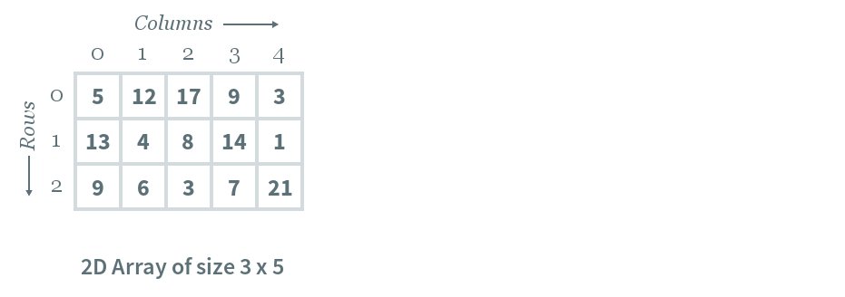

# Array

## 1-Dimensional Array
An array is a sequential collection of elements of same data type and stores data elements in a continuous memory location. The elements of an array are accessed by using an *index*. The index of an array of size N can range from 0 to N-1. For example, if your array size is 5, then your index will range from 0 to 4 (5-1). Each element of an array can be accessed by using *arr[index]*.

Consider following array. The size of this array is 5. If you want to access 12, then you can access it by using arr[1]


### Array declaration and initialization

Declaring and initialized an array is language-specific.

For example, in C/C++, to declare an array, you must specify, the following:

- Size of the array: This defines the number of elements that can be stored in the array.

- Type of array: This defines the type of each element i.e. number, character, or any other data type.
```c++
int arr[5]; //declare an array with size = 5, type is integer
int arr[5] = {4, 12, 7, 15, 9}; //declare and initialize array
```

In Java, you must specify type of array:
```java
int[] arr; //declare an array with type is integer, 
int[] arr = {4, 12, 7, 15, 9}; //declare and initialize array
```

In PHP or Javascript, type of variable is determined when its assiged value, so we don't declare type of array:
```PHP
$arr = array(4, 12, 7, 15, 9); //an integer array
$arr = array("abc", "def"); //an string array
```

### Processing an Array:

The most basic form of processing an array is to loop over the array and print all its elements.

A sample of processing an array by looping over the array and printing its elements is as follows:
```pseudocode
1. Declare and initialize array: arr[size]
2. Loop i from 0 to size - 1
2.1 print arr[i]
```

Java example:
```java
int[] arr = {4, 12, 7, 15, 9};
for (int i = 0; i < arr.length; i++) {
    System.out.println(arr[i]);
}
```
PHP example:
```php
$arr = array(4, 12, 7, 15, 9);
for ($i = 0; $i < sizeof($arr); $i++) {
    echo arr[$i] . "\n"; // \n is for new line
}
```

## Multi-Dimensional Array

A multi-dimensional array is an array of arrays. 2-dimensional arrays are the most commonly used. They are used to store data in a tabular manner.

Consider following 2D array, which is of the size 3x5. For an array of size NxM, the rows are numbered from 0 to N-1 and columns are numbered from 0 to M-1, respectively. Any element of the array can be accessed by arr[i][j] where 0 <= i < N and 0 <= j < M. For example, in the following array, the value stored at arr[1][3] is 14.



### Array declaration and initialization
C/C++
```c++
int arr[3][5]; //declare an 2-D array of integer with 3 rows and 5 columns
int arr[3][5] = {{5, 12, 17, 9, 3}, {13, 4, 8, 14, 1}, {9, 6, 3, 7, 21}}; // declare and initialize
```
Java
```java
int[][] arr = {{5, 12, 17, 9, 3}, {13, 4, 8, 14, 1}, {9, 6, 3, 7, 21}};
```
PHP
```php
$arr = array(
    array(5, 12, 17, 9, 3), //each item of $arr is an array
    array(13, 4, 8, 14, 1),
    array(9, 6, 3, 7, 21),
)
```

### Processing Array
To loop over the 2-D array and printing its elements is as follows:
```pseudocode
1. Declare and initialize array: arr[row][col]
2. Loop i from 0 to row - 1
2.1  Loop j from 0 to col - 1
2.1.1 print arr[i][j]
```
So we must use 2 loops to access all array element.

Java example:
```java
int[][] arr = {{5, 12, 17, 9, 3}, {13, 4, 8, 14, 1}, {9, 6, 3, 7, 21}};
for (int i = 0; i < arr.length; i++) {
    for (int j = 0; j < arr[i].length; j++) {
        System.out.print(arr[i][j] + " ");
    }
    System.out.println();
}

```

PHP example:
```php
$arr = array(
    array(5, 12, 17, 9, 3), //each item of $arr is an array
    array(13, 4, 8, 14, 1),
    array(9, 6, 3, 7, 21),
);
for ($i = 0; $i < sizeof($arr); $i++) {
    for ($j = 0; $j < sizeof($arr); $j++) {
        echo $arr[$i][$j] . ' ';
    }
    echo "\n";
}

```

## Homework
1. Given an array with N elements, calculate the average, sum, min and max of elements in array

|   Input    | Average| Sum    | Min    | Max    |
|------------|--------|--------|--------|--------|
|5 12 17 9 3 |  9.2   |   46   |   3    |  17    |
|13 4 8 14 1 |  8     |   40   |   1    |  14    |
|9 5 3 7 21  |  9     |   45   |   3    |  21    |

2. Given 2 arrays A and B (each array of size N). Print new array C such that: C[i] = A[i] + B[i], 0 <= i < N

|   Input A  | Input B| Output C|
|------------|--------|---------|
|1 2 3 4 5   | 4 5 3 2 10 | 5 7 6 6 15 |

3. Given an array A of length N, calculate the minimum value of the following expression:

       
      
      0 <= i <= j < N

|Input  | Output|
| ----  |----|
|1 0 0 0 4 | -3 |
|0 1 -4 0 4 | -7 |
|-3 0 -1 0 -4 | -13 |

4. Given an array with NxM elements, calculate the average, sum, min and max of elements in array

|   Input    | Average| Sum    | Min    | Max    |
|------------|--------|--------|--------|--------|
|5 12 17 9 13 <br> 13 4 8 14 1  <br> 9 5 3 17 21 |  10  | 150  |  1  |  21 |
