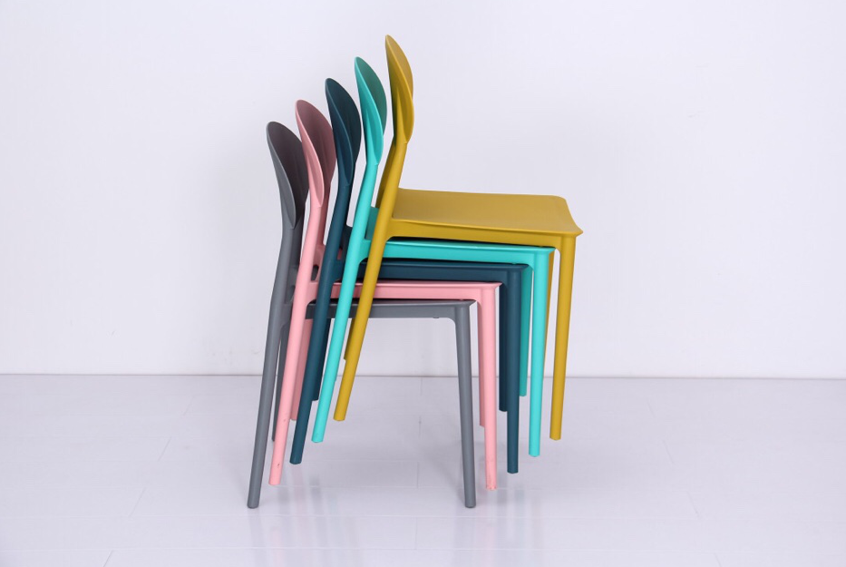

# Stack

Lets start with following problem in the life. 

*Chair folding:* imagine your family have some chairs used for dinner, lunch. When ending the meal, you have to fold them because you don't have enough space in your room (below image). 
Your big son likes yellow chair, his younger sister likes pink one, blue for your wife, grey for your mother and green for you. After your lunch, you fold them as the order green, grey, blue, pink, yellow. A question is that what is the order when you take them to prepare the dinner? Its same your order folding: green, grey, blue, pink, yellow -> No, its wrong. The correct answer is: yellow, pink, blue, grey, green. You can take only the chair that you folded last, it also means the first you folded, the last you take. Is it easy?? Hahaha, Its so simple. And **Stact** is nothing more than folding chairs.

Stacks are dynamic data structures that follow the Last In First Out (LIFO) principle. The last item to be inserted into a stack is the first one to be deleted from it.

For example, you have a stack of trays on a table. The tray at the top of the stack is the first item to be moved if you require a tray from that stack.